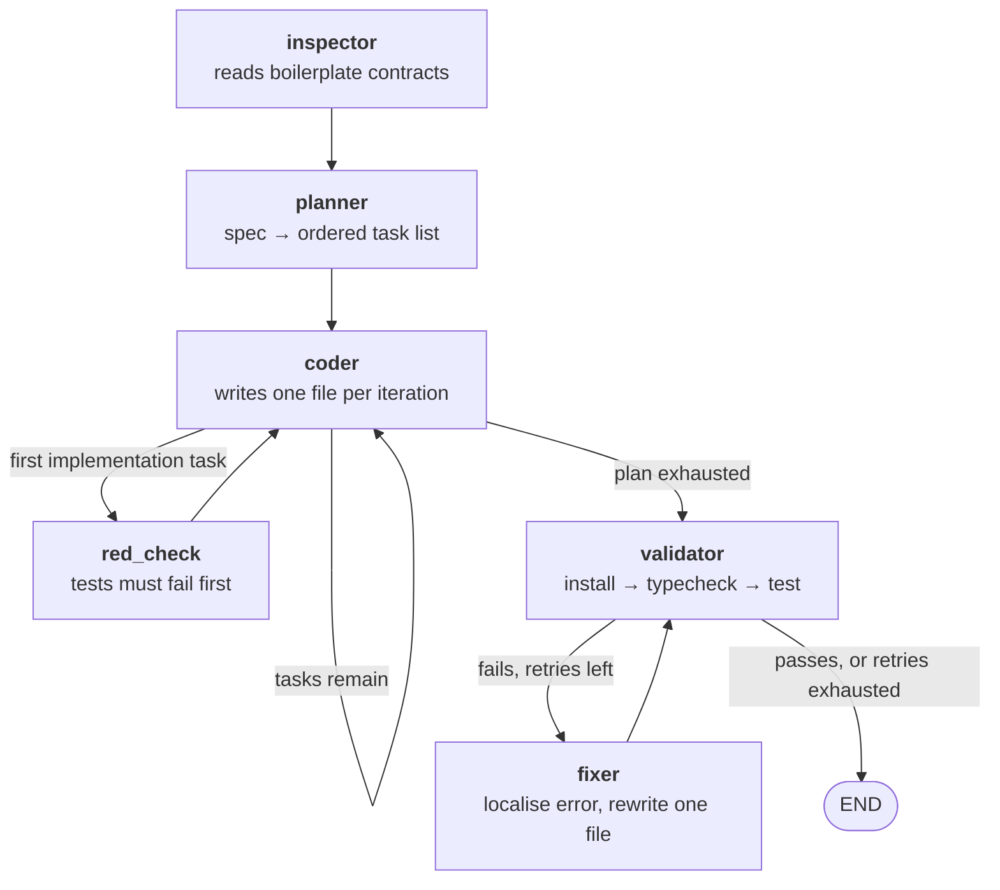

# Agentic Code Generation Workflow

This is my submission for the take-home challenge. The original brief is kept at
[`CHALLENGE.md`](CHALLENGE.md).

I built a Python CLI agent. It reads a natural-language spec and generates a React +
TypeScript frontend into a copy of the provided boilerplate. It plans the work as ordered
tasks, writes each file, then runs the project's own typecheck and tests against what it
produced. When validation fails, it reads the error and repairs the file.

**The agent is the deliverable.** I have committed a sample of its output in
[`generated-app/`](generated-app/) so you can inspect the result without paying for a run.

---

## Quick start

You need Node 20 or later, and an Anthropic API key. `make setup` installs
[uv](https://docs.astral.sh/uv/) if you do not already have it.

### The short version

```bash
make setup                                        # installs uv, syncs the Python env
echo "ANTHROPIC_API_KEY=sk-ant-..." > agent/.env  # one key is all it needs

make generate      # runs the agent. About 12 minutes and about $2.40.
make test          # typechecks and tests what it generated
make dev           # serves it at localhost:5173
```

Run `make` on its own to list every target. To use a different spec:

```bash
make generate SPEC=spec-alt.md
```

### The manual version

These are the same steps as the "Getting Started" section of the brief. Step 4 is my
agent in place of `node agent.js`.

```bash
# 1. Clone this repo (contains the boilerplate)
git clone <repo-url> && cd Fullstack-Coding-Challenge

# 2. Verify the boilerplate works
npm install
npm run dev        # Should run at localhost:5173
npm run test       # Should pass (2 tests)
npm run typecheck  # Should pass

# 3. Set up the agent
cd agent
uv sync
echo "ANTHROPIC_API_KEY=sk-ant-..." > .env

# 4. Run the agent
uv run run.py --spec spec.txt --output ../generated-app
cd ..

# 5. Verify the output
cd generated-app
npm install
npm run dev
```

Each run deletes and rebuilds the output directory. A lock file stops two runs from
overwriting each other.

---

## What a run looks like

The agent prints its progress while it works. It writes the same information to
`agent/logs/<timestamp>_generated_logs.txt`. I have committed one of those logs at
[`agent/logs/sample-run.txt`](agent/logs/sample-run.txt). Read it if you want to see a full
task breakdown without running anything.

```
Plan created 15 tasks (6,755 in / 5,814 out)

Plan: 15 tasks across 4 features (numbered in execution order)

  Car listing
     1. src/hooks/useCarInventory.ts            (scaffold)
     2. src/__tests__/useCarInventory.test.tsx  (test)
    10. src/hooks/useCarInventory.ts            (implementation)

  Search and filtering
     3. src/__tests__/useCarFilters.test.ts     (test)
    11. src/hooks/useCarFilters.ts              (implementation)
  ...

Red phase   Tests fail before implementation, as expected.
Validation  Typecheck & tests: FAILED
Fixer       Self-healing: patched src/components/CarFilters.tsx
Validation  Typecheck & tests: PASSED

Tokens (claude-opus-5): 407,192 in, 57,795 out
Cache: 245,678 read (60% of input reused), 27,307 written
Estimated cost: $2.41
```

Tasks are grouped by the feature they serve. They are numbered in the order they run. The
numbers jump around inside a feature because the agent works test-first. It writes every
test before it writes any of the code that satisfies them.

---

## How it works

The agent is a state machine with six nodes, built on LangGraph.



| Node | What it does |
|---|---|
| `inspector` | Reads the boilerplate's contract files in full. Lists every other path, so the planner can reuse what already exists. |
| `planner` | Turns the spec into an ordered task list. Each task names one file and is tagged `scaffold`, `test` or `implementation`. |
| `coder` | Writes one file per iteration. It is shown every file it has already written. |
| `red_check` | Runs the suite once the tests exist and no implementation does. This proves the tests actually fail. |
| `validator` | Installs dependencies, then runs the project's own typecheck and test scripts. |
| `fixer` | Reads the failure, opens the files it names, and rewrites exactly one of them. |

---

## Decisions I made

Every one of these is a tradeoff. The full list is in
[`docs/PROJECT.md`](docs/PROJECT.md#key-decisions).

- **I used `claude-opus-5` for every node.** Planning and repair are the decisions that
  cost the most when they go wrong. A bad plan fails in a way no retry recovers from. I
  chose to pay for the call that decides rather than for the retries after a bad one. I
  did not benchmark a cheaper model, so this is a judgement and not a measurement.
- **I enforce test-first by sorting, not by asking.** The planner tags each task with a
  phase. The code then sorts by that phase. A test written after its implementation is not
  test-first, whatever the plan claims. Sorting makes the property true by construction.
- **I added a red-phase check.** Ordering alone only proves the tests were written first.
  Running them before any implementation exists proves they actually fail. A suite that
  passes at that point is asserting nothing.
- **Validation runs the project's own scripts.** The agent is held to the same bar a human
  contributor would face. I did not write separate checks, because mine could quietly be
  weaker than the real ones.
- **Both model decisions use enforced schemas.** The plan and each repair are constrained
  by Pydantic models. Neither is parsed out of prose.
- **No spec knowledge lives in the prompts.** An agent that only works on the spec it was
  tuned against is a template. I tested this with a second, unrelated spec.

---

## Cost per run

These figures are measured, not estimated. The full table is in
[`docs/PROJECT.md`](docs/PROJECT.md#measured-runs).

| Spec | Tasks | Input | Output | Cost |
|---|---|---|---|---|
| `spec.txt` | 18 | 548,592 | 74,047 | $4.59 |
| `spec-alt.md` | 14 | 285,395 | 57,222 | $2.86 |
| `spec.txt`, with prompt caching | 15 | 407,192 | 57,795 | $2.41 |

**A run costs roughly $2.40 to $4.60.** The price scales with how much the spec asks for.

I added prompt caching near the end of the project. The agent re-sends every file it has
written into each following call, so most of a run's input is repeated text. I reordered
the prompt so the repeated text comes first, which lets the API reuse it. That took input
reuse from 16% to 60% and made an identical run 31% cheaper.

---

## Generalization

The prompts contain no domain knowledge. To show that, I wrote a second spec,
[`agent/spec-alt.md`](agent/spec-alt.md). It describes a fleet board filtered by colour,
with no model search.

The agent produced a different application from it. That app has a colour picker, a count
of matching cars, and tests asserting that a search box is **absent**. That last point is
the one I am most pleased with. "There is no free-text search on this screen" is a negative
requirement written in prose, and the agent tested for it.

Both specs produced suites that pass in full. Neither output mentions the other's domain.

---

## Known limitations

- **There is no cross-file consistency pass.** Files are written one at a time and never
  reconciled as a set. This works here because dependencies flow in one direction, from
  schema to hook to component. A spec that required two files to change together would
  need a step this design does not have.
- **The repair budget is small.** The agent gets three validation attempts, which means two
  repairs. On a spec that produces four or more separate failures that is not enough, and
  the run ends with some failures never reached.
- **The fixer is the most expensive node, and it is not cached.** Its calls are about
  60,000 input tokens each. They account for most of what a run still pays full price for.
  I accepted this to keep the caching change small. It is the first thing I would fix next.

---

## Repository

```
agent/                  the deliverable
  run.py                CLI, boilerplate copy, run loop
  graph.py              node wiring and routing
  nodes.py              the six nodes and their prompts
  state.py              typed state and Pydantic schemas
  tools.py              file I/O, the validators, the run lock
  reporting.py          run logging
  config.py             model id and cost rates
  tests/                the agent's own tests
  spec.txt              the sample spec
  spec-alt.md           a second, unrelated spec
  logs/sample-run.txt   a committed run log

generated-app/          committed sample output, written by the agent
src/                    the boilerplate you provided
docs/                   write-up, decisions, and process
```

**Start with [`docs/WRITEUP.md`](docs/WRITEUP.md).** It covers which model I chose and why,
what a run costs, what worked, and what I would do with more time.
