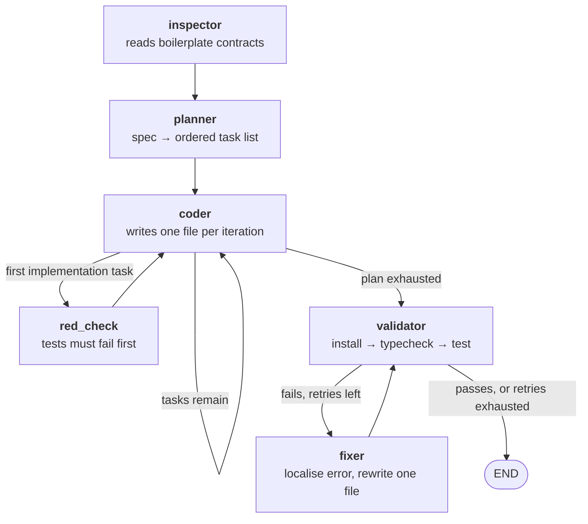

# Write-up

Which model I used, what a run costs, and the tradeoffs I made. Setup instructions are in
the [root README](../README.md). The full decision list is in [`PROJECT.md`](PROJECT.md).

---

## Which model, and why

I used **`claude-opus-5`** for every node. It costs $5.00 per million input tokens and
$25.00 per million output tokens.

My reasoning:

- **The expensive calls are planning and repair, not writing code.** Each is a single
  decision. If it is wrong, the whole run suffers. A plan that orders a component before
  the hook it imports produces failures no retry can recover from.
- **A repair budget of two attempts leaves no room for a bad diagnosis.** Paying more for
  the call that decides is cheaper than paying for the retries after a bad one.
- **Both decisions are schema-constrained**, using `AgentPlan` and `FixResult`. The model
  must return a valid object rather than prose I have to parse. An earlier version of the
  fixer split free text on `FILE:` markers. Under adaptive thinking the response content is
  a list of blocks, so that check was always false and the fixer silently wrote nothing on
  every retry of every run. Enforced schemas made that class of bug impossible.
- **The coder sees every file it has already written.** Input therefore grows through a
  run, so a large context window matters.

**What I did not do:** I did not benchmark a cheaper model. `ANTHROPIC_MODEL` makes that a
one-line change. I have not run the comparison, and I would rather say so than imply a
measurement I never took.

---

## Architecture

Six nodes on a LangGraph state machine. I chose LangGraph because the
coder → validator → fixer cycle genuinely is a state machine with conditional edges.
Writing it by hand would have reimplemented the same control flow less clearly.

Per-node responsibilities are in the [root README](../README.md#how-it-works).

---

## Cost per run

| Spec | Tasks | Input | Output | Cost |
|---|---|---|---|---|
| `spec.txt` | 18 | 548,592 | 74,047 | $4.59 |
| `spec-alt.md` | 14 | 285,395 | 57,222 | $2.86 |
| `spec.txt`, with prompt caching | 15 | 407,192 | 57,795 | $2.41 |

- **A run costs about $2.40 to $4.60.** The price scales with how much the spec asks for.
- **Input dominates output by about six to one.** The agent re-sends every file it has
  written into each following call.
- **Failed runs cost more, not less.** Every retry is another planner-grade call.

---

## Tradeoffs I made

**I inject every previously generated file into every coder call.**
The alternative is selecting only the files a task depends on. Injecting everything is
simple and removed a whole class of bug, where a component imported a name its hook did not
export. The cost is that context grows quadratically. I accepted this because these apps
are a dozen small files. It would not survive a larger spec.

**I made the work test-first, which roughly doubled the cost per run.**
Tests are written before implementations, so they sit in the manifest and are re-sent to
every later call. I judged the tradeoff worth it. The tests are the specification the
implementation is written against, and the red-phase check proves they fail before any code
exists. Without that, "test-first" is only a claim about ordering.

**I capped the repair budget at three validation attempts, which allows two repairs.**
This bounds the damage a pathological failure can do. It is not enough for a spec that
produces four or more separate failures, and I have seen runs end with failures never
reached. Raising it trades a bounded cost for a better completion rate.

**I left the fixer uncached.**
Caching pays off from the second request onward, and the fixer makes at most two calls, so
I skipped it to keep the change small. Its calls turned out to be about 60,000 input tokens
each. They are now most of what a run still pays full price for. This was the wrong call in
hindsight, and it is first on the list below.

**I copy the boilerplate into a separate output directory rather than generating in place.**
Every run starts from a known-clean tree, and a bad run cannot corrupt the source. The
agent refuses to delete the working directory or the boilerplate itself.

---

## What worked

- **Showing the coder its own output.** Before this, each file was generated blind, and
  components imported names their hooks did not export. This removed that failure entirely.
- **Showing the planner the whole boilerplate.** Sending the contract files in full, and
  every other path as a list, cut a 22-task plan that rebuilt the Apollo client, MSW mocks
  and Vite config down to 13 tasks that touched none of it. The final run modifies exactly
  one file I was given.
- **Proving the tests fail before writing code.** Sorting makes the ordering true. The
  red-phase check makes the failure real.
- **Retrying only what is worth retrying.** The retry policy covers timeouts, rate limits
  and server errors, and nothing else. LangGraph's default retries any exception, which
  turns one real bug into five slow identical failures. A single overload error had already
  destroyed a 12-task run at task 9.
- **Writing prompt rules against failures I actually saw.** Every negative constraint in
  the prompts exists because a run failed that way. One example: the coder once chose
  "Tesla Model 3" as the car a test adds, and the seeded mock data already contained a Tesla
  Model 3, so the assertion matched two cards.
- **Reordering the prompt for caching.** Most of a run's input is repeated text. Putting
  the repeated part first, and splitting the newest file into its own block, took input
  reuse from 16% to 60% and made an identical run 31% cheaper.

---

## What I would do with more time

1. **Cache the fixer.** It is now the most expensive node and the only one not cached, at
   roughly 60,000 input tokens per call. That is most of the remaining full-price spend.
2. **Select context instead of injecting all of it.** The manifest grows quadratically.
   Caching reduced what that costs but did not make it smaller.
3. **Raise the repair budget, and let the fixer address more than one file per cycle.**
   Runs are still ending with failures the fixer never reached.
4. **Add a plan-only mode.** One planner call, print the task list, exit. A reviewer could
   then inspect the decomposition for cents rather than for the price of a full run.
5. **Run independent files in a phase concurrently.** Generation is sequential today. Tests
   within a phase do not depend on each other, so this is mostly wall-clock time left on
   the table.

---

## Known limitations

- **There is no cross-file consistency pass.** Files are written one at a time and never
  reconciled as a set. This holds here because dependencies flow in one direction, from
  schema to hook to component, so each file only has to be correct against files already
  written. A spec requiring two files to change together would need a step this agent does
  not have.
- **Feature labels are the planner's judgement, not a derived fact.** One run filed
  `CarGallery` under *Search* and `App.tsx` under *Add car form*. Both are defensible.
  Neither is exact. The phase ordering is the part that is guaranteed.
- **Output quality is bounded by the spec.** There is no domain knowledge in the prompts,
  so anything the spec does not ask for does not get built. That is deliberate, and
  [`spec-alt.md`](../agent/spec-alt.md) is the evidence.
