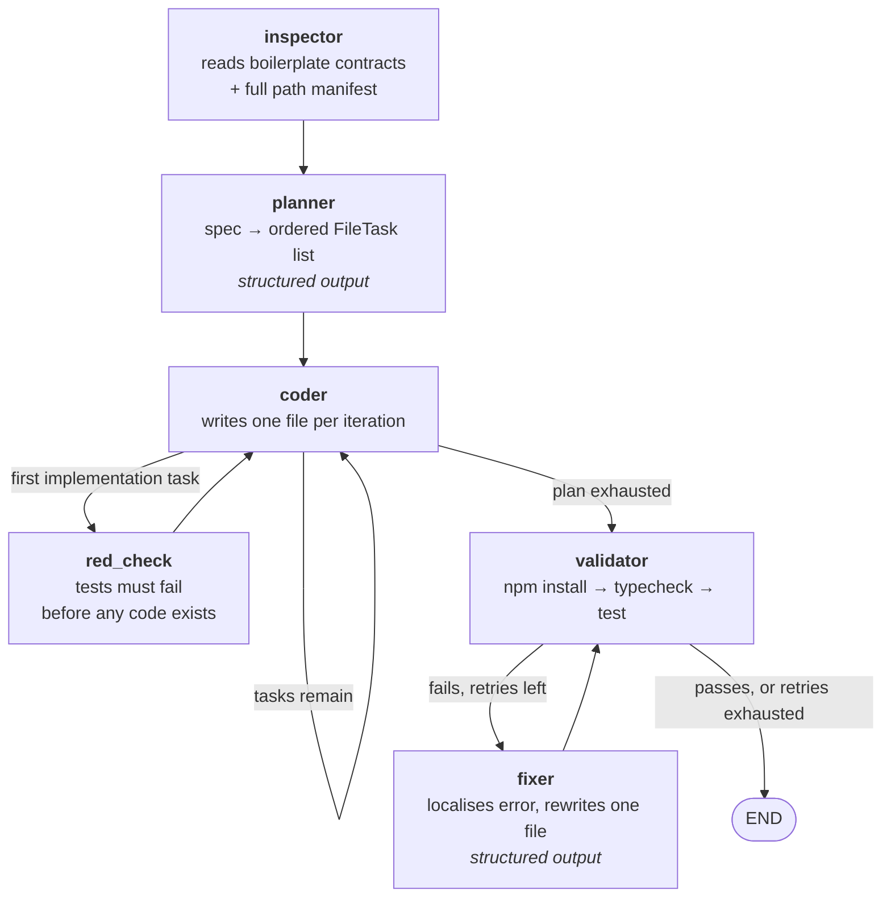

# Write-up — Agentic Code Generation Workflow

The short version. Architecture, model choice, real measured cost, and the limitations I
know about. Full detail lives in [`PROJECT.md`](PROJECT.md); the stage board is in
[`TICKETS.md`](TICKETS.md).

---

## What it is

A Python CLI agent that reads a natural-language product specification and generates a
React + TypeScript frontend into a copy of the provided boilerplate. It decomposes the
spec into ordered file-level tasks, writes each file, runs the project's own
`npm run typecheck` and `npm run test` against its output, and feeds failures back into a
repair loop until the suite passes or the retry budget runs out.

**The deliverable is the agent.** The generated app is evidence that the agent works.

---

## Setup

Requires **Node 20+**, [**uv**](https://docs.astral.sh/uv/), and an Anthropic API key.

```bash
git clone <repo-url> && cd Fullstack-Coding-Challenge

cd agent
uv sync                                  # locked Python env
echo "ANTHROPIC_API_KEY=sk-ant-..." > .env

uv run run.py --spec spec.txt --output ./generated-app
```

Then run what it built:

```bash
cd generated-app && npm install && npm run dev   # http://localhost:5173
```

A `Makefile` at the repo root wraps the same three commands — `make generate`,
`make test`, `make dev`. To generate from a different spec:
`make generate SPEC=spec-alt.md`.

All CLI paths default relative to `agent/`: `--spec spec.txt`, `--boilerplate ..`,
`--output ./generated-app`. The model is read from `ANTHROPIC_MODEL` and defaults to
`claude-opus-5`, so the whole pipeline can be pointed elsewhere without editing node code.

Every run writes a log to `agent/logs/<timestamp>_generated_logs.txt` recording the plan
and every step. One is committed as [`../agent/logs/sample-run.txt`](../agent/logs/sample-run.txt)
if you want to read a full run without spending an API call.

---

## Which model, and why

**`claude-opus-5`**, at $5.00 / 1M input and $25.00 / 1M output tokens.

The expensive parts of this agent are not the code-writing calls — they are **planning**
and **repair**. Both are single reasoning-heavy decisions where being wrong costs the
whole run: a plan that orders a component before the hook it imports produces a cascade
of failures no amount of retrying fixes, and a fixer that misdiagnoses burns a retry from
a budget of three. I would rather pay for the call that decides than pay for the retries
that follow a bad decision.

Two concrete reasons beyond raw capability:

- **First-class structured output.** Both generative decisions are schema-constrained —
  `AgentPlan` and `FixResult` via `with_structured_output(..., method="json_schema")`.
  The model must satisfy a Pydantic schema rather than emit prose I parse hopefully. An
  earlier version of the fixer hand-split on `FILE:` markers; under adaptive thinking
  `response.content` is a list of blocks, so the guard was always false and the fixer
  silently wrote nothing on every retry of every run. Schema enforcement made that class
  of bug impossible.
- **Context headroom.** The coder is shown every file it has already written this run, so
  input grows through the run — 5,127 tokens on the first coder call, 30,347 on the last.

**The honest caveat:** I did not benchmark a cheaper model. `config.MODEL_ID` makes the
swap a one-line env change, so the comparison is cheap to run — I just have not run it,
and I would rather say so than imply a measurement I did not take.

---

## Architecture

Six nodes on a LangGraph state machine. LangGraph earns its place because the
coder → validator → fixer cycle genuinely *is* a state machine with conditional edges;
hand-rolling it would reimplement the same control flow less legibly.



| Node | Responsibility |
|---|---|
| `inspector` | Reads the boilerplate's contract files in full and lists every other path, so the planner reuses what exists instead of rebuilding it |
| `planner` | Spec → ordered `FileTask` list, each tagged `scaffold` / `test` / `implementation` and labelled with the feature it serves |
| `coder` | Writes one file per iteration, shown every file written so far this run |
| `red_check` | Runs the suite once the tests exist and no implementation does, to prove they actually fail |
| `validator` | Installs dependencies once, then runs the project's real typecheck and test scripts |
| `fixer` | Regexes `src/...` paths out of the failure, reads those files, rewrites exactly one |

Three design choices worth calling out:

**Work is planned test-first, and the ordering is sorted rather than trusted.** The
planner tags each task with a phase and `planner_node` stable-sorts by it. A test emitted
after its implementation is not a failing-test-first workflow whatever the plan claims;
sorting makes the property hold by construction, and the stable sort preserves dependency
order within each phase.

**The red phase verifies the tests actually fail.** Without it, "test-first" is only a
claim about ordering. A suite that passes before any implementation exists asserts
nothing, and `red_check` says so rather than letting it go green later for the wrong
reason.

**Validation shells out to the project's own scripts.** The agent is held to exactly the
bar a human contributor would face — no bespoke checks that could quietly be laxer than
CI.

---

## Cost per run

Measured, not estimated. Full history in [`PROJECT.md`](PROJECT.md#measured-runs).

| Run | Tasks | Input | Output | Cost | Result |
|---|---|---|---|---|---|
| `spec.txt` | 15 | 315,167 | 46,753 | **$2.74** | 68/68 tests, typecheck clean, dev 200 |
| `spec-alt.md` | 14 | 285,395 | 57,222 | **$2.86** | 68/68 tests, typecheck clean, dev 200 |

**Roughly $2.75–$3.00 for a clean run.** Across every measured run including the failures
the range is **$1.92 – $4.19**; runs that exhaust the retry budget cost more, not less,
because each retry is another planner-grade call.

Input dominates output roughly 6:1, which is the manifest at work — every file the coder
has written is re-injected into the next call. Per-task input climbs **5,127 → 30,347**
across a single run. That is the cost curve to attack first if this needed to scale.

---

## What worked well

- **Showing the coder its own output.** Before the manifest, each file was generated
  blind and components imported names their hooks did not export. Injecting every prior
  file eliminated that class of failure outright.
- **Showing the planner the whole boilerplate.** Sending contract files in full and every
  other path as a list cut a 22-task plan that rebuilt the Apollo client, MSW mocks and
  Vite config down to 13 tasks touching no boilerplate at all. The final run modifies
  exactly one provided file, `App.tsx`.
- **Structured output everywhere a decision is made.** Both the plan and the fix are
  schema-constrained, which removed the fragile prose-parsing described above.
- **Retrying only what is worth retrying.** The retry predicate covers connection faults,
  timeouts, 429s and 5xxs, and nothing else — LangGraph's default retries any unrecognised
  exception, which turns a genuine bug into five slow identical failures. A single 529 had
  previously aborted a 12-task run at task 9 and discarded everything before it.
- **Prompting against observed failures, not imagined ones.** Each negative constraint in
  the prompts exists because a run failed that way: no no-op tasks, no domain nouns in the
  planner, and no test fixture that collides with the seeded mock data.

---

## What I'd improve with more time

1. **Stop the fixer re-patching a file that did not improve.** It can spend its whole
   budget rewriting the same file without noticing the failure is unchanged.
   `last_patched_file` is already in state and unused for this. Highest-value fix here.
2. **Select context instead of injecting all of it.** The manifest is quadratic. A larger
   spec needs the coder to pull the files a task actually depends on.
3. **Test the agent itself.** The agent holds generated code to a bar it does not meet —
   there is no pytest suite over `resolve_project_path`, the phase sort, or the error
   localiser. That asymmetry is the weakest part of this submission.
4. **Guard concurrent runs.** Two runs against the same output directory silently corrupt
   each other, since generation begins by deleting the target. This cost a real run
   mid-validation during development.
5. **Per-feature red/green slices.** Tasks carry a feature label but execute phase-major.
   Running each feature as its own test → implement → verify slice would tighten the
   feedback loop, at the cost of a more complex graph.

---

## Known limitations

**No cross-file consistency pass after generation.** Files are written one at a time and
never reconciled as a set. This holds for this application because dependencies flow one
direction — schema → hook → component — so each file only needs to be correct against
files already written. A spec requiring two files to co-mutate shared state would need a
dedicated integration step, and this agent does not have one. The validator would catch
the resulting breakage, but the fixer repairs one file per cycle, so a genuine two-file
contract change is not something this design resolves.

**Feature labels are the planner's judgement, not derived fact.** Tasks are grouped by the
capability they serve, but the grouping is an opinion — one run filed `CarGallery` under
*Search* and `App.tsx` under *Add car form*. Defensible, not exact. The phase ordering is
the part that is guaranteed.

**The generated app's quality is bounded by the spec.** The agent is deliberately
spec-driven with no domain knowledge in its prompts, so anything the spec does not ask
for does not get built. Verified by running an unrelated spec
([`spec-alt.md`](../agent/spec-alt.md), a colour-filtered fleet board): the output filters
by colour, shows a match count, and its tests assert the *absence* of model search —
a negative requirement the agent read out of prose. Neither run's output mentions the
other's domain.

---

## A note on process

Work was planned as stages before it was built; the board in [`TICKETS.md`](TICKETS.md)
carries acceptance criteria per stage, and each stage landed as its own focused commit.

One exception is recorded honestly rather than hidden: commit `8ac8db2` landed the entire
five-node pipeline in a single commit, before the board existed. It hides how the pipeline
actually came together. Rewriting history to pretend otherwise would be worse, so it is
noted at the top of the ticket board instead, along with the one-ticket-one-commit rule
that has applied since.
